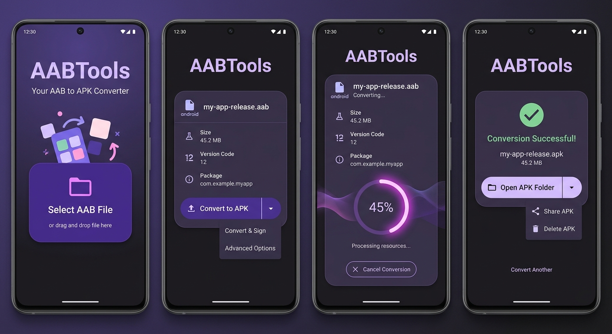

# AABTools - Your AAB to APK Converter

AABTools는 Android App Bundle(.aab) 파일을 Android Package(.apk) 파일로 손쉽게 변환하고, 변환된 APK를 디바이스에 바로 설치할 수 있도록 돕는 데스크탑 도구입니다.

## UI 스크린샷



## 주요 기능

- **AAB to APK 변환**: Android App Bundle 파일을 범용 APK 파일로 변환합니다.
- **APK 설치**: 변환된 APK 파일을 연결된 Android 디바이스에 즉시 설치합니다.
- **키스토어 관리**: 서명을 위한 키스토어 프로필을 생성하고 관리할 수 있습니다.
- **직관적인 UI**: Compose for Desktop을 활용한 깔끔하고 사용하기 쉬운 인터페이스를 제공합니다.

## 사용 방법

1. **AAB 파일 선택**: 변환하고자 하는 `.aab` 파일을 선택합니다.
2. **키스토어 설정**: 서명에 사용할 키스토어 파일과 정보를 입력합니다.
3. **변환 시작**: 변환 버튼을 클릭하여 APK 생성을 시작합니다.
4. **설치**: 변환이 완료된 후, 'Install' 버튼을 눌러 디바이스에 설치합니다 (ADB 연결 필요).

## 기술 스택

- **Kotlin Multiplatform**: 비즈니스 로직 및 데스크탑 앱 구축
- **Compose for Desktop**: 선언형 UI 프레임워크
- **Bundletool**: Google의 공식 AAB 처리 도구 활용
- **ADB (Android Debug Bridge)**: 디바이스 통신 및 설치 지원

## 개발 및 빌드

이 프로젝트는 Gradle을 사용하여 빌드됩니다.

### 실행하기
```bash
./gradlew :app:run
```

### 배포 패키지 생성
```bash
./gradlew :app:packageDmg  # macOS
./gradlew :app:packageMsi  # Windows
./gradlew :app:packageDeb  # Linux
```

## 라이선스

이 프로젝트는 개인적인 용도로 개발되었으며, 사용 시 Bundletool의 라이선스 규정을 준수해야 합니다.
